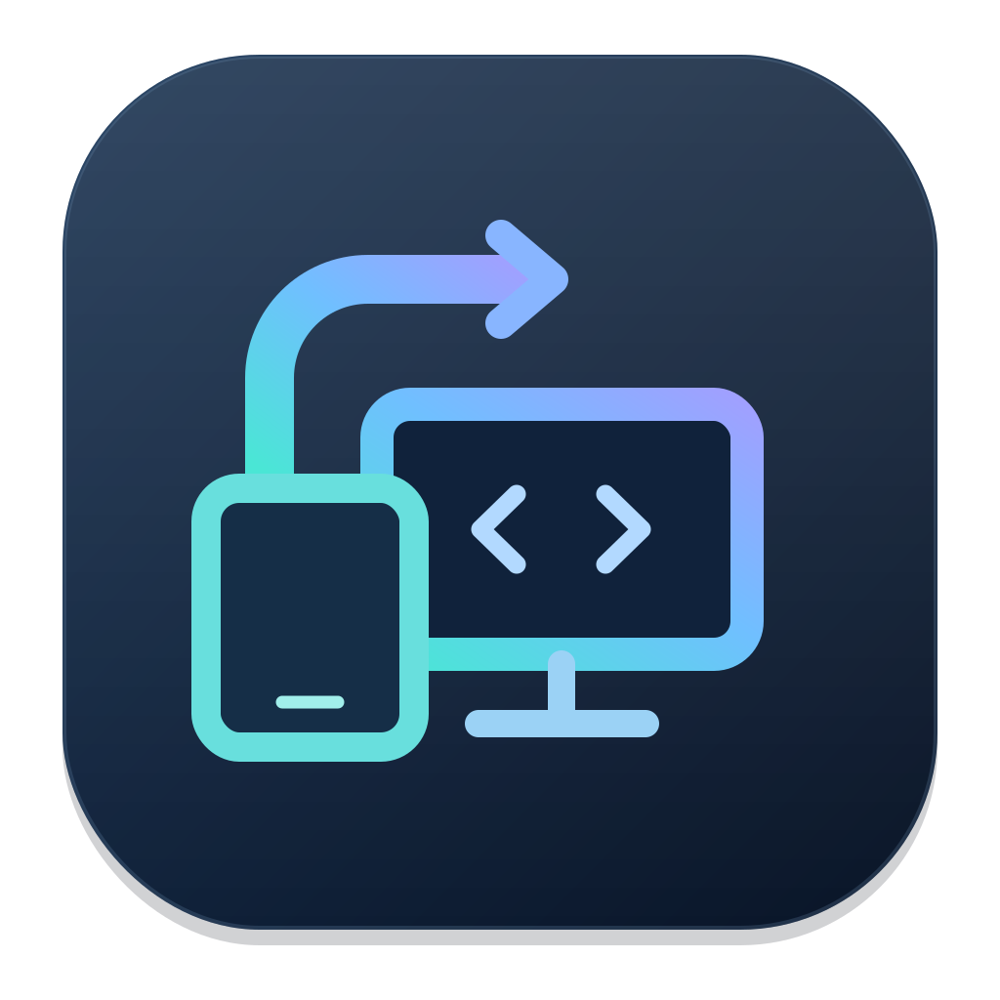

<div align="center">
  
  <h1>FjärrConnect</h1>
  <p><strong>Your remote machines, in one Mac app.</strong></p>
  <p>
    <a href="https://github.com/yeager/FjarrConnect/actions/workflows/ci.yml"></a>
    <a href="https://github.com/yeager/FjarrConnect/actions/workflows/gitleaks.yml"></a>
    
    
    
  </p>
</div>

FjärrConnect brings **VNC / Mac Screen Sharing, RDP, SSH and SFTP** into one connection
manager for **macOS 14 or later**, on **Apple Silicon (arm64) and Intel (x86_64)**.
There are no Windows, Linux or mobile app targets.

**[GitHub repository](https://github.com/yeager/FjarrConnect)**

## Version 0.2.20

**[Download version 0.2.20](https://github.com/yeager/FjarrConnect/releases/tag/v0.2.20)**
for Apple Silicon and Intel. Choose `FjarrConnect-0.2.20-macOS-arm64.zip` for Apple Silicon, or
`FjarrConnect-0.2.20-macOS-x86_64.zip` for Intel. Each app contains only its target
architecture. Unzip the archive and move FjärrConnect to Applications.
`SHA256SUMS.txt` contains both download checksums.

Version 0.2.20 makes Mac CI resilient to Xcode's spurious exit 65 after a verified passing
test result. Real test failures still fail the build. Saved profiles still connect on
**double-click**; a single click only selects the profile. Saved profiles and Keychain
passwords are retained.

Every release passes gitleaks, Mac regression tests, separate architecture packaging and
checks of the downloaded app on both native Mac architectures before publication.

The downloads use **ad-hoc signing**, not Developer ID signing or Apple
notarization. macOS may require approval under **System Settings → Privacy & Security**
on first launch. Never disable Gatekeeper globally to install the app.

## Features

- **Favorites:** click the star beside a saved connection to pin it to the Favorites
  section. Click again to remove it. Favorites persist between launches, work with
  search, and preserve compatibility with existing saved profiles.
- **Saved connections:** create, edit and delete profiles with a name, host, port,
  protocol, username and optional group. Single-click to select a saved profile;
  **double-click to connect**, including favorites. Right-click for connection and editing actions.
- **Session tabs:** keep multiple connections open and switch between them. Closing
  a connected tab, the main window or the app asks for confirmation first. Cancel
  leaves sessions and transfers running. RDP desktops stay inside their tabs.
- **Search:** find saved connections by name, host, group or protocol, and filter
  discovered Macs by name.
- **Quick connect:** press **⌘K**, enter an address, then press Return.
- **New connection:** press **⌘N**. Leave the name blank to use the hostname.
- **Network discovery:** automatically list advertised VNC, RDP and SSH services
  through Bonjour. Choose **Find servers** to search an IPv4 network for services
  that do not advertise. Select a result to connect or save it as a profile.
- **Keychain credentials:** save VNC and RDP passwords in the macOS Keychain. Quick
  connections can use a password without saving it.
- **Files:** open an SFTP tab from a connection’s context menu. Browse, upload and
  download files or folders, rename items, create folders and delete files or empty
  folders. Transfers show progress and can be cancelled.
- **Advanced options:** select an SSH identity, jump host and local/remote/SOCKS
  forwards; configure an RDP gateway and explicitly shared folders.
- **Host links:** open a configured SMB share in Finder or an HTTPS administration
  page in your browser. These use the system apps’ authentication.
- **SSH command log:** enable separately for each saved SSH connection. Stores command
  names and timestamps in an encrypted local log, with no arguments or terminal transcript.
- **Localized interface:** English, Swedish, Danish, Norwegian Bokmål, German, Finnish, French,
  Spanish and Japanese. Follows your macOS language preference; a language can also be
  selected for FjärrConnect in **System Settings → General → Language & Region → Applications**.
  Relaunch the app after changing its language.
- **Refreshed icon:** an editable SVG master with all required Mac icon sizes.

## Protocols

| Protocol | How it works | Authentication |
|---|---|---|
| VNC / Mac Screen Sharing | Embedded desktop through [RoyalVNCKit](https://github.com/royalapplications/royalvnc), with keyboard, mouse and clipboard support | VNC password or remote Mac username/password; optional Keychain storage |
| SSH | Embedded [SwiftTerm](https://github.com/migueldeicaza/SwiftTerm) terminal running macOS `/usr/bin/ssh`, with optional encrypted keep-alives during idle periods | Your SSH configuration, keys and ssh-agent; passwords and new host-key confirmation in the terminal |
| RDP | Embedded [FreeRDP](https://github.com/FreeRDP/FreeRDP) desktop, keyboard/mouse, resizing, text and image clipboard, shared folders and gateway settings | Username/password; localized certificate verification and separate gateway credentials |
| SFTP | Built-in file panel using the authenticated OpenSSH connection | Keys/agent or interactive password and host-key prompts |

**Standard VNC uses only a password:** leave Username empty and enter the server's
VNC password. A username is used only when the server requires account authentication,
such as Apple Remote Desktop or UltraVNC MS Logon II. For a Mac using account
authentication, enter that Mac account's short username and password. If the server
requires no authentication, leave both fields empty.

**RDP is bundled:** no Homebrew installation is needed for the downloaded app.
The CI/release pipeline builds a self-contained FreeRDP runtime for both Mac
architectures. Each app loads its matching native library inside the app process;
no separate client window or Homebrew installation is used. Unknown or changed
certificates show the server identity and SHA-256 fingerprint with **Cancel**,
**Connect once**, and **Trust and connect** in the chosen interface language.
Certificate verification remains enabled. The Windows desktop-start disconnection
caused by disabled network-latency measurements is fixed in 0.2.7. Desktop display,
resizing and a sustained connection were checked against a Windows server using NLA.
Other connection failures show a localized error.

SSH passwords are entered directly in the terminal and are **not** saved by
FjärrConnect. SSH private keys remain managed by OpenSSH and your ssh-agent.
The status “Client running” for SSH means the terminal process started; OpenSSH
shows authentication in that terminal. RDP and SFTP report Connected only after
their protocol connection is established.

## Finding servers on your network

Bonjour listens for `_rfb._tcp`, `_rdp._tcp` and `_ssh._tcp` advertisements, including
IPv6 services. Many Windows RDP servers do not advertise themselves. Choose
**Find servers** in the sidebar to search for them, select a local network or enter
an IPv4 CIDR such as `192.168.1.0/24`, and press **Search**. The proposed range uses
the current interface's subnet, limited to the local /24 on larger networks.

Enable the protocols you want and adjust their comma-separated ports if needed.
Defaults are VNC 5900/5901, RDP 3389 and SSH 22. A result requires a VNC or SSH
protocol banner, or an RDP connection-negotiation response; an unrelated service
with an open port is not listed. Discovery does not send passwords, authenticate,
or open a desktop session. Finding a server does not prove its authentication
method or desktop configuration is supported.

Searches show progress and can be cancelled. They use at most 32 concurrent
connections with a two-second deadline per probe. IPv4 ranges /20–/32 and up to
16,384 address/port checks per search are supported. A /31 or /32 includes every
address; other ranges exclude the network and broadcast addresses. Use a smaller
range if a large network needs several searches. IPv6 hosts can be found through
Bonjour or entered manually; IPv6 address-space scanning is not implemented.

Select a result and choose **Save** to add it without a password, or **Connect** to
start the normal connection flow. Double-clicking a search result also connects.
Saved profiles still require a double-click. Saving the same address, protocol and
port again selects the existing profile. Results remain in the sidebar for the
current app session; the search does not run automatically on launch. If no services
appear, check server settings, the selected network/ports, VPN/firewall rules and
FjärrConnect's Local Network permission in System Settings.

## Clipboard, files and connection options

VNC has a per-profile **Share text clipboard with the active session** setting. RDP
has **Share text and image clipboard with the active session**, including screenshots
copied in either direction with Windows peers that advertise the standard DIB image
format. Only the selected session in the foreground window may synchronize clipboard
contents. Switching tabs does not automatically send existing clipboard contents to
another server. Copy again after activating the intended tab. RDP’s standard macOS
Edit menu actions send the corresponding Ctrl shortcuts to the remote application.

VNC negotiates Unicode text with Extended Clipboard peers, including TigerVNC;
legacy VNC peers are limited to Latin-1. Text is bounded to 1 MiB. VNC clipboard
images, rich text and clipboard file copying are not implemented. The VNC extension and
session policy are pinned to a tested fork revision. Extended Clipboard is
proposed upstream in [RoyalVNCKit PR #38](https://github.com/royalapplications/royalvnc/pull/38);
the active-session policy remains in FjärrConnect’s SDK fork.

For files, choose **Files (SFTP)** from a host’s context menu. VNC/RDP profiles can
specify a separate SSH address, port, username and starting directory under
Advanced options. The destination must run an SSH server with SFTP enabled.
Authentication stays in an embedded terminal; the file panel opens after it succeeds.
Uploads can also be started by dropping files onto the panel. Existing files require
confirmation before replacement. Folders are transferred recursively without merging
into existing folders; symbolic links and special files are rejected. Transfers use
private staging files, and originals are preserved on failure. In the current
published version (0.2.20), cancelling an upload or download keeps the
authenticated SSH connection and
refreshes the file panel, so you can continue without signing in again.
The file table also uses native row actions: single-click selects,
double-click opens a folder or downloads a file, and right-click offers file
actions. Double-click works across the row, including the size and date columns.
If a regular-file upload or download is cancelled or the SFTP channel is interrupted,
FjärrConnect retains its private `.fjarrconnect.partial` staging file. Start the same
transfer again to resume it. Before reusing the staging file, FjärrConnect compares
its complete transferred prefix with the source; a mismatch is discarded and the
transfer starts over. Directory uploads use the same verified per-file resume behavior;
directory downloads use the same verified per-file resume behavior.

SSH forwards listen on loopback by default. A forwarding failure is reported by
OpenSSH instead of silently opening a session without the requested tunnel. Identity
files and SSH configuration remain on your Mac.

RDP shared folders are explicitly selected in Advanced options and appear as
`Shared1`, `Shared2`, etc. on the remote desktop. They grant read/write access to the
selected directories. Paths containing commas are currently rejected by the native
backend’s argument format. Remote Desktop server policy may disable drive or
clipboard redirection. A gateway can reuse the desktop credentials or use a separate
username/password, saved in a separate Keychain item when requested.

RDP adapts the remote desktop to the window size by default. If a legacy server,
or an RDP-to-VNC gateway, rejects a display resize or disconnects during one, disable
**Adapt remote desktop to window size** in that profile’s Advanced options and
reconnect. The remote desktop then keeps its initial size.

RDP currently presents one desktop surface per tab. Multi-monitor layouts, RemoteApp,
USB/printer redirection and clipboard file transfer are not exposed. RoyalVNCKit’s
VNC authentication currently covers None, VNC password, Apple Remote Desktop and
UltraVNC MS-Logon II; VeNCrypt/TLS and RSA-AES authentication remain unsupported.
Use SFTP or a configured SMB share for files instead of a VNC-specific file protocol.

## Private SSH command logs

1. Create or edit a saved connection, choose **SSH**, and enable **Log SSH command names**.
2. Save and connect. If the connection is already open, disconnect and connect again.
3. Open **SSH command log** from the connection's context menu or the lock/document
   button above its terminal. **Refresh log** reads new entries.

Logging is **off by default** and independent for each saved connection. The terminal
shows whether logging is active, waiting for a supported shell, or unavailable.
Choose **Stop command logging** in the connection's context menu to stop accepting
new events in its open sessions immediately. Previously stored entries remain until
you delete them or they expire. Reconnecting uses the latest saved preference.

Use **Delete log** to remove that connection's history and encryption key. If logging
is still enabled, subsequent commands start a new encrypted log. Deleting the saved
connection closes its sessions and deletes its log, including a log left over after
changing the connection's protocol.

The log contains **timestamps and command names only**. It never records SSH/sudo
password input, keystrokes, arguments, environment values, command output, or a
terminal transcript. A fixed vocabulary recognizes common tools such as `ls`,
`git`, `sudo` and `systemctl`; all other names become **Other command**. This prevents arbitrary
input, including an unrecognized pasted password, from becoming a stored name.
For example, any invocation of `curl` is recorded only as `curl`, without its options or values.

Logging uses temporary **Bash or Zsh shell hooks** after SSH authentication, not
keyboard capture or screen scraping. It records the first command for each shell
input, including commands recalled from history. Commands inside scripts, nested
shells, `sudo -s`, and subsequent nested SSH connections are not traced. Complex
shell input may be shown as Other command. Existing Bash DEBUG hooks are preserved
and make logging unavailable. Custom startup files can also disable integration;
check the session's logging status. The SSH connection remains usable. This is a
personal history, not a tamper-proof server audit trail.

The logging shell loads `.bashrc`, or `.zshenv` and `.zshrc` (respecting `ZDOTDIR`),
as an interactive shell. Login-only files such as `.bash_profile` and `.zprofile`
are not loaded in this mode. Startup wrappers contain fixed integration code in a
private temporary directory on the server and are removed when the session ends;
existing server configuration files are not edited. The server's own shell history
and logging remain under its configuration; FjärrConnect does not manage them.

Files under `~/Library/Application Support/FjarrConnect/SSHCommandLogs/` use
**AES-256-GCM authenticated encryption**, with a separate random key per saved
connection in the macOS Keychain. Keys are not written next to the logs or synced
by this app. The directory is restricted to its owner (0700), and log files use
0600 permissions. Reads validate the encrypted data and connection identity;
corrupt files are preserved rather than overwritten. If Keychain or encryption
fails, logging stops with a visible message and never falls back to plaintext.
This protects files at rest; it does not protect against someone controlling your
unlocked macOS account.

| Property | Behavior |
|---|---|
| Stored content | Time and a recognized command name; otherwise **Other command** |
| Excluded content | Arguments, passwords, terminal input/output and environment values |
| Storage | AES-256-GCM ciphertext on this Mac; separate Keychain key per saved connection |
| Retention | At most 1,000 entries; entries older than 30 days removed on read/write |
| Log deletion | Removes that connection's file and Keychain encryption key |
| Export | No plaintext export |

Logs stay with their saved connection when its name/address is edited; delete the
old log when repurposing a profile.

## Connect to a Mac

1. On the remote Mac, enable **System Settings → General → Sharing → Screen Sharing**.
2. Open FjärrConnect. Allow Local Network access if macOS asks.
3. Select the Mac under **On Your Network**, or enter `vnc://studio.local` in Quick Connect.
4. Enter the remote Mac account's username and password. For a saved profile, you can
   remember the password in Keychain.
5. Save frequently used machines with **⌘N**, then click their star to make them favorites.

If the remote Mac uses **Remote Management** instead of Screen Sharing, the account
also needs **Observe** and **Control** rights in its Remote Management options.
Membership in the Screen Sharing group alone is not sufficient. A server can report
“Authentication or authorization failure” even when the password is correct.
If authentication succeeds but the image stays black, macOS may still be denying
screen capture or input to its sharing agent. Turn Remote Management off and on
**locally on the remote Mac**, then approve any permission request. Apple documents
this requirement in its [Remote Management setup guide](https://support.apple.com/guide/remote-desktop/apd8b1c65bd/mac).
FjärrConnect displays a hint for a persistently black or missing initial image;
the hint clears when desktop content arrives. It does not change the remote
computer’s access permissions.

RDP requires a listening Remote Desktop service on the destination port (normally
3389). The app reports the destination, a recognized error category and the client
exit code when a connection fails. Backend logs and passwords are not displayed
or saved as diagnostics.

Quick-connect examples:

```text
studio.local
vnc://admin@studio.local:5901
ssh://deploy@server.local:2222
sftp://deploy@server.local:2222
rdp://user@workstation.local
vnc://[::1]:5900
```

Ports must be between **1 and 65535**. Passwords, query parameters and arbitrary
paths are rejected in connection URLs; use the sign-in dialog for credentials.
In the profile editor, enter only the hostname/IP in the Host field and the port in
its own field. IPv6 addresses in URLs use brackets.

## Credentials and local data

Profiles are stored in:

```text
~/Library/Application Support/FjarrConnect/profiles.json
```

The JSON contains connection details and favorite state, **not passwords**. VNC/RDP
passwords are stored as per-profile Keychain items. When editing a profile, enable
**Change saved password** to replace it; an empty replacement removes the saved password.

Saving reports errors instead of silently losing changes. An unreadable or corrupt
profile file is preserved and blocks further saves so it cannot be overwritten by
an empty connection list. Back up the file before repairing or removing it.

VNC encryption depends on the server and authentication protocol; use a trusted
network or VPN. SSH retains OpenSSH host-key checks, and RDP retains certificate
verification. RDP credentials are passed directly to the embedded library in memory;
they are not operating-system process arguments or temporary profile files. Raw
OpenSSL/FreeRDP logs are disabled. Gateway and desktop passwords use separate
Keychain items.

## Build from source

You need **Xcode 16.4+** and [XcodeGen](https://github.com/yonaskolb/XcodeGen).
The Xcode project is generated from `project.yml`.

```bash
git clone https://github.com/yeager/FjarrConnect.git
cd FjarrConnect
brew install xcodegen
xcodegen generate
open FjarrConnect.xcodeproj
```

Build for your Mac (use `ARCHS=arm64` or `ARCHS=x86_64` to select explicitly):

```bash
xcodebuild -project FjarrConnect.xcodeproj -scheme FjarrConnect \
  -configuration Release -destination 'generic/platform=macOS' \
  ARCHS="$(uname -m)" ONLY_ACTIVE_ARCH=YES CODE_SIGNING_ALLOWED=NO build
```

Run Mac tests for the host architecture:

```bash
python3 scripts/with-vnc-test-fixture.py xcodebuild -project FjarrConnect.xcodeproj -scheme FjarrConnect \
  -configuration Debug -destination 'platform=macOS' \
  ARCHS="$(uname -m)" ONLY_ACTIVE_ARCH=YES \
  CODE_SIGN_IDENTITY=- CODE_SIGNING_REQUIRED=NO test
```

The wrapper starts a VNC banner fixture on `127.0.0.1:45905` for the network
discovery UI test and a private OpenSSH server for the file-browser UI test.
It closes both when the test command exits. The SFTP UI test uses real row
selection, folder navigation, rename/delete, standard upload/download file
panels and session-close confirmation. Xcode's sandboxed UI-test runner cannot
host the listening sockets itself. SFTP integration tests separately
start an unprivileged, loopback-only OpenSSH server with temporary keys and
isolated configuration. They cover encrypted-key authentication, rejected host
keys, concurrent sessions, tab switching and cancellation in both directions.
They do not change the user's SSH configuration or known-hosts file.

`scripts/build-rdp.sh arm64` and `scripts/build-rdp.sh x86_64` build the bundled RDP
runtime from pinned FreeRDP and OpenSSL sources on a Mac with CMake available.
CI packages each output separately with `scripts/build-release.sh arm64` or
`scripts/build-release.sh x86_64`. A normal
Xcode build does not automatically compile or bundle the RDP runtime.

## GitHub Actions and releases

Development is on **`main`**.

- **CI:** checks localizations and icons, runs macOS regression tests (including
  encrypted SSH logging, Bash/Zsh integration, Keychain access, native profile/log UI
  and profile controls in all nine languages,
  password-authenticated VNC rendering, desktop resizing and recovery from black frames), builds both RDP
  runtime slices and packages separate ARM64 and Intel apps. Packaging verifies the single
  architecture of the app and all embedded native code, checks ad-hoc signatures, compares
  all compiled translation tables against their source, and creates
  a ZIP archive with a SHA-256 checksum. Separate Apple Silicon and Intel jobs
  download their ZIP, verify it, start the actual app without Xcode search paths,
  reproduce the missing-framework failure in a disposable copy, and exercise the
  embedded RDP library against a disposable TLS negotiation fixture. The test
  checks the certificate dialog and rejection in all nine languages. This checks
  TLS/UI integration, not a full Windows logon. New commits automatically cancel
  obsolete CI runs for the same branch; regression-test jobs have a 30-minute limit.
- **gitleaks:** scans the complete repository history on pushes to `main` and pull
  requests. The release workflow also requires a clean full-history scan.
  `.gitleaksignore` contains one exact historical finding for a removed, fictional
  README credential example. No scanner rule or source path is broadly excluded.
- **Release:** a tag matching `MARKETING_VERSION`, such as **`v0.2.20`**, triggers a
  fresh scan, test and build. GitHub publishes the release assets only when these pass.

For maintainers, after the current `main` revision passes verification:

```bash
git pull --ff-only
git tag v0.2.20
git push origin v0.2.20
```

Do not reuse or move an already published release tag. Use a new version for fixes.
Release notes are maintained in `RELEASE_NOTES.md`.

Local checks (use Gitleaks **8.30.1**, matching CI):

```bash
python3 scripts/check-resources.py
gitleaks detect --source . --redact
gitleaks detect --source . --no-git --redact
git diff --check
```

An optional pre-commit hook is configured in `.pre-commit-config.yaml`.

## Project layout

| Directory | Purpose |
|---|---|
| `App` | App lifecycle and session ownership |
| `Model` | Profiles, favorites, validation, persistence and Keychain access |
| `Protocols` | VNC, RDP, SSH and SFTP session implementations |
| `NativeRDP` | Embedded FreeRDP AppKit view and native integration probe |
| `Views` | Connection list, tabs, profile editor and sign-in UI |
| `Discovery` | Bonjour browsing and endpoint resolution |
| `Resources` | Mac app icon and nine interface/permission localizations |
| `Tests` | Regression tests for profiles, favorites, sessions, VNC and SSH |
| `UITests` | Native Mac UI tests for favorites, private SSH logs and all nine languages |
| `scripts` | Resource validation, icon generation and release/runtime builds |

`RemoteSession` is the common backend interface. `ConnectionManager` owns session
tabs; UI code does not need to know each backend's transport implementation.

## Icon and localization

`icon.svg` is the editable icon master. Regenerate `icon.png`, `icon.icns` and all
Mac asset-catalog sizes with:

```bash
python3 -m pip install cairosvg pillow
python3 scripts/generate-icon.py
python3 scripts/check-resources.py
```

User-facing strings live in `Resources/{en,sv,da,nb,de,fi,fr,es,ja}.lproj/Localizable.strings`.
The matching `InfoPlist.strings` files translate the local-network permission message.
When adding or changing a string, update all nine languages together. Run
`python3 scripts/check-resources.py` to check syntax, duplicate or empty entries, key
parity and format placeholders such as `%d`. The release and download checks also
compare the compiled tables in each app with the source. Native UI tests launch the
app in every language and capture the SSH profile editor.

## License

FjärrConnect is [MIT licensed](LICENSE). Dependencies retain their own licenses:
RoyalVNCKit (MIT), SwiftTerm (MIT), and FreeRDP and OpenSSL (Apache-2.0). Bundled
RDP dependency notices are copied
into the app's `Contents/Resources/Licenses` directory by the packaging workflow.
No Remmina source code is included.
